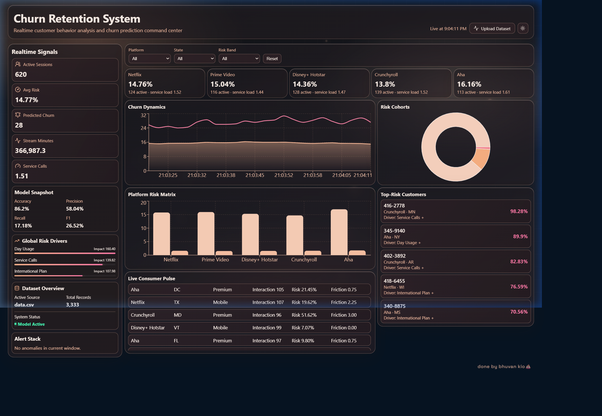

# Churn Retention System

> Realtime customer behavior analysis and churn prediction command center.



---

## Features

- **Realtime Streaming Analytics** — Socket.io powered live data stream updating every 2.2s
- **ML Churn Prediction** — Logistic regression model trained in-browser on your dataset
- **Platform Risk Matrix** — Per-platform churn risk breakdown (Netflix, Prime, Disney+, Crunchyroll, Aha)
- **Risk Cohort Distribution** — Visual segmentation of Low / Medium / High risk customers
- **Top-Risk Customer Leaderboard** — Live ranked list of customers most likely to churn
- **Global Risk Drivers** — Aggregated feature importance across the active stream window
- **Dataset Upload** — Drop in your own `.csv` to retrain the model on the fly
- **Theme Support** — Dark / Light / AMOLED modes

---

## Tech Stack

| Layer | Tech |
|-------|------|
| Frontend | React 19, Vite, Recharts, Framer Motion, Socket.io-client |
| Backend | Node.js, Express 5, Socket.io |
| ML | Logistic Regression (vanilla JS, no external ML libs) |

---

## Getting Started

### Prerequisites
- Node.js 18+

### Run Locally

**1. Install dependencies**
```bash
cd server && npm install
cd ../client && npm install
```

**2. Start the backend**
```bash
cd server
node index.js
# Server runs at http://localhost:4000
```

**3. Start the frontend**
```bash
cd client
npm run dev
# App runs at http://localhost:5173
```

> The default dataset is `data/data.csv`. Drop any telecom churn CSV with compatible columns into `data/` to use your own data, or upload via the **Upload Dataset** button in the UI.

---

## Dataset

The included dataset (`data/data.csv`) contains **3,333 telecom customer records** with the following key features used for churn prediction:

| Feature | Description |
|---------|-------------|
| `account length` | Tenure in days |
| `international plan` | Has international plan (yes/no) |
| `voice mail plan` | Has voicemail plan (yes/no) |
| `total day/eve/night minutes` | Usage minutes |
| `customer service calls` | Number of service calls |
| `churn` | Ground truth label |

---

## Project Structure

```
hackathon/
├── client/          # React + Vite frontend
│   └── src/
│       ├── App.jsx  # Main dashboard component
│       └── App.css  # Styles & theme variables
├── server/
│   └── index.js     # Express + Socket.io server + ML model
├── data/
│   └── data.csv     # Default dataset
└── assets/
    └── preview.png  # App screenshot
```

---

*done by bhuvan kio 💩*
